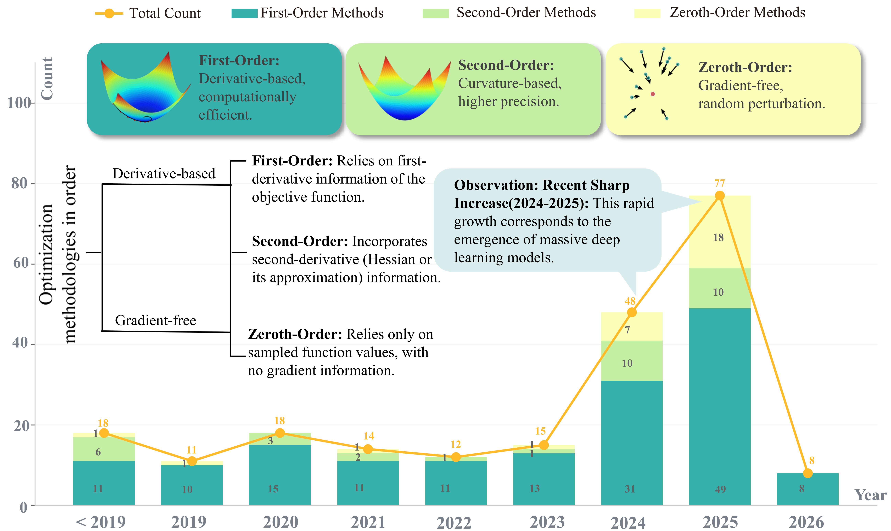
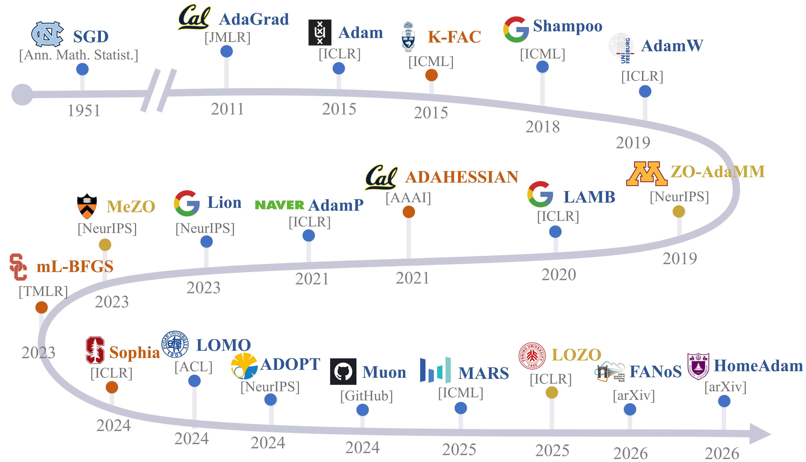
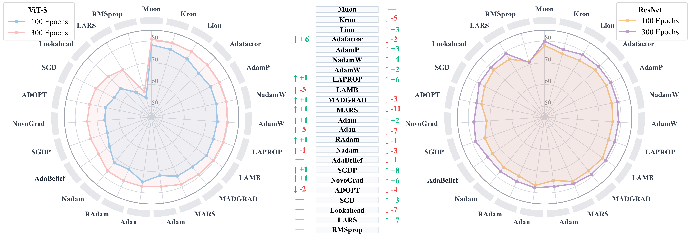

# Evolution of Optimization Methods: Algorithms, Scenarios, and Evaluations

<div align="center">

<a href="https://github.com/sindresorhus/awesome"></a>
<a href="LICENSE"></a>
[](https://arxiv.org/)
<a href="CONTRIBUTING.md"></a>
<a href="assets/wechat.png"></a>
[](https://github.com/APRIL-AIGC/awesome-optimizer)


</div>

[Tong Zhang](https://scholar.google.com.hk/citations?hl=zh-CN&user=WsEUmpwAAAAJ&view_op=list_works&gmla=AF9nlQsB3CdUdRLrWHi9n_CwlbjpAQF4s01SgZMA212-nS3JzQjGGYmH_SRMgvuu1AHgiXAIw0h81427vtjl_3_IeQwZ9GUm0nlwcPbu9Jc),
[Jiangning Zhang](https://zhangzjn.github.io)†<sup></sup>,
[Zhucun Xue](https://scholar.google.com/citations?user=m3KDreEAAAAJ&hl=zh-CN),
[Juntao Jiang](https://github.com/juntaoJianggavin),
[Yicheng Xu](https://github.com/xuyicheng-zju),
[Chengming Xu](https://chmxu.github.io/),
[Teng Hu](https://scholar.google.com/citations?user=Jm5qsAYAAAAJ&hl=zh-CN),
[Xingyu Xie](https://scholar.google.com/citations?user=BpFCmZMAAAAJ&hl=zh-CN),
[Xiaobin Hu](https://scholar.google.com/citations?user=3lMuodUAAAAJ&hl=en)†,
[Yabiao Wang](https://scholar.google.com/citations?user=xiK4nFUAAAAJ&hl=zh-CN),
[Yong Liu](https://scholar.google.com/citations?user=qYcgBbEAAAAJ&hl=zh-CN)†,
[Shuicheng Yan](https://scholar.google.com/citations?user=DNuiPHwAAAAJ&hl=en)

---

## 📖 Overview

Foundational optimization algorithms are the core driving force behind deep learning, evolving from early stochastic gradient descent (SGD) to the widely adopted Adam family. However, as the scale of modern foundation models grows massively, this optimization paradigm is forced to expand, encountering new physical and systemic bottlenecks during large-scale training. In particular, stringent differential privacy requirements and distributed training paradigms have exposed critical limitations of conventional approaches regarding privacy protection and memory efficiency.

However, existing reviews on optimization algorithms often focus on narrow technical fields, e.g., first-order and second-order, lacking a comprehensive perspective on the field's evolution, especially regarding **Zeroth-order** and **Scenario-oriented paradigms**.

To address these gaps, this survey provides a **systematic review** of the development of optimization algorithmss, tracing its evolution through **four major paradigms**:

> **First-order methods** → **Second-order methods** → **Zeroth-order methods** → **Scenario-oriented paradigms** 

We conduct comprehensive **theoretical analysis** and standardized **empirical evaluations**, objectively pointing out the pros, cons, and fundamental design trade-offs of various methods across different architectures. By synthesizing theoretical insights with extensive empirical evidence, we distill key developmental trends and provides actionable guidance and future research directions for designing next-generation efficient, robust, and trustworthy optimization algorithms.

### 🎯Contributions

1️⃣ **Unified Taxonomy**: Establishing a rigorous mathematical taxonomy that unifies disparate conceptual definitions across fundamental optimization primitives.
  - 📊 **Evolutionary Trajectory** tracing the development of foundational algorithms from First-Order to Second-Order and Zeroth-Order methods.
  - 🔬 **Intrinsic Connections** clarifying the complex evolutionary logic and structural relationships between different optimization approaches to provide a coherent framework for the field.

2️⃣ **Scenario-Oriented Analysis**: Demonstrating how foundational algorithms are fundamentally re-architected into scenario-oriented paradigms to address severe physical bottlenecks.
  - 📈 **Systems-Aware Engineering** highlighting the critical shift from pure algorithmic design to practical solutions that balance theoretical guarantees with strict engineering constraints.
  - 🔍 **Overcoming Systemic Barriers** detailing how these paradigms tackle specific, real-world challenges such as distributed communication barriers and strict differential privacy constraints.

3️⃣ **Standardized Evaluation**: Introducing a rigorously controlled evaluation framework that strictly separates pure algorithmic performance from large-scale engineering optimizations.
  - 🚀 **Extensive Benchmarking** developing a standardized testbed to evaluate 23 distinct optimizers across diverse architectural proxies, including CNN and Transformer-based models.
  - 🔮 **Strategic Insights** systematically isolating and examining learning rate sensitivity, long-term training scalability, and cross-architecture generalization to guide the design of next-generation optimizers.

---
## 📈Evolution



> **📈 A Comprehensive Analysis of Optimization Methods**: This figure systematically summarizes the development trends and core characteristics of optimization methodologies across different orders.
 > - **Key Insights**:Attention to optimization algorithms experienced a sharp increase since 2024. This explosive growth is closely tied to the rapid development of massive models, with first-order methods maintaining a dominant position.

---

## 🚩Timeline



> **Timeline of prominent optimization algorithms**. The evolution highlights key algorithmic milestones, associated research institutions, and publication venues over time.

---


## 🏗️ Architecture Overview

### 🗂️ **A Comprehensive Taxonomy of Optimization Algorithms**


> **📐 Taxonomy Overview**: This framework categorizes existing works based on three dominant paradigms, First-Order Methods, Second-Order Methods, and Zeroth-Order Methods, and further structures them according to their fundamental mathematical principles and evolutionary development. Key branches include:
> - 🚀 First-Order Methods: Gradient-Driven (e.g., SGD) $\rightarrow$ Adaptive Learning Rate (e.g., Adam) $\rightarrow$ Acceleration to Automation (e.g., Adan, Nadam) $\rightarrow$ Scalar to Preconditioner (e.g., Shampoo) $\rightarrow$ Stability to Temporal (e.g., SPAM) $\rightarrow$ Temporal to Geometry (e.g., SAM).
> - ⚙️ Second-Order Methods: Deterministic Curvature to Geometry (e.g., K-FAC, AdaFisher) $\rightarrow$ Approximation to Iterative Update (e.g., ADAHESSIAN).
> - 📍 Zeroth-Order Methods: Perturbation Optimization (e.g., FZOO, LeZO) $\rightarrow$ Adaptive to Resource-Aware (e.g., MeZO, ZO-AdaMM) $\rightarrow$ Variance Reduction to Adaptive (e.g., MeZO-SVRG).

### 📊 **Benchmark Evaluation Results on Vision Tasks**



> **📈 Benchmark Evaluation**: This comprehensive assessment evaluates 23 representative optimization algorithms across continuous vision architectures (ViT-S and ResNet-50) and varying training horizons:
> - ⏱️ Short-Term Convergence (100 Epochs): Evaluates the rapid descent capability and initial exploration efficiency of optimizers within a constrained computational budget.
> - 🏃 Long-Term Scalability (300 Epochs): Assesses the algorithm's resilience against late-stage gradient noise and its capacity to continually extract representational power over extended cycles.
> - 📊 Ranking Dynamics: Tracks relative performance shifts across epochs, highlighting how algorithms dynamically navigate the trade-off between early acceleration and long-term stability.

---

**🔥Add Your Paper in our Survey!!!!!**

 You are welcome to give us an issue or PR for your optimizer work !!!!!

 Note that: Due to the huge paper in arXiv, we are sorry to cover all in our survey. You can directly present a PR into this repo and we will record it for next version update of our survey.

**🔥New**
 - **[2026.04.13]** We update GitHub to record the available paper by the end of 2026/4/13.

---

### 🔨Installation

To reproduce our benchmarks, you need to clone this repository and install the required dependencies. We strongly recommend using a virtual environment (e.g., Conda).

```bash
# 1. Clone the repository
git clone https://github.com/JZhangTon/awesome-optimizer.git
cd awesome-optimizer

# 2. Install required packages
pip install -r requirements.txt
```
### ⚙️Usage & 📈Benchmarking
>- To start a training run and reproduce our benchmark results, you can execute the provided training scripts. We provide a script for easy benchmarking. See [examples/benchmark](examples/benchmark.ipynb) to see how to use it.

---

## 🗂️Taxonomy of Optimization Algorithms

- [🚀 First-Order Algorithms](#fo)
- [⚙️ Second-Order Algorithms](#so)
- [📍 Zeroth-Order Algorithms](#zo)
- [🌐 Distributed Optimization](#do)
- [🛡️ Privacy-Preserving Optimization](#po)
- [⚡ Memory-Efficient Optimization](#mo)
- [🧩 Tailored Optimization Approaches](#to)

### <a id="fo"></a>🚀 First-Order Algorithms

| Abbreviation | Venue & Year | Paper Title | Project | Sub-methods | Fine-grained Methods | 
| --- | --- | --- | --- | --- | --- | 
| HomeAdam |  | HomeAdam: Adam and AdamW Algorithms Sometimes Go Home to Obtain Better Provable Generalization | [Link](https://arxiv.org/abs/2603.02649) | Adaptive Step-Size Control | Second-order moment adaptation | 
| FlashOptim |  | FlashOptim: Optimizers for Memory-Efficient Training | [Link](https://arxiv.org/abs/2602.23349) | Memory-Efficient Optimization | Low-Memory Optimizer Design |
| FANoS |  | FANoS: Friction-Adaptive Nos´e–Hoover Symplectic Momentum for Stiff Objectives | [Link](https://arxiv.org/pdf/2601.00889) | Accelerating Convergence Rate | Momentum Damping Mechanism | 
| NOVAK |  | NOVAK: Unified adaptive optimizer for deep neural networks | [Link](https://arxiv.org/abs/2601.07876) | Hybrid Methods | Gradient Smoothing Hybrid | 
| AdamNX |  | AdamNX: An Adam improvement algorithm based on a novel exponential decay mechanism for the second-order moment estimate | [Link](https://arxiv.org/abs/2511.13465) | Adaptive Learning Rate Methods | Second-Order Moment Adaptation | 
| ROOT |  | ROOT: Robust Orthogonalized Optimizer for Neural Network Training | [Link](https://arxiv.org/abs/2511.20626) | Adaptive Learning Rate Methods | Momentum-based Adaptive |
| AuON |  | AuON: A Linear-time Alternative to Orthogonal Momentum Updates | [Link](https://arxiv.org/abs/2509.24320) | Gradient Normalization & Clipping | Layer-Wise Gradient Normalization | 
| ZetA |  | ZETA: A HYBRID OPTIMIZER COMBINING RIEMANN ZETA SCALING WITH ADAM FOR ROBUST DEEP LEARNING | [Link](https://arxiv.org/abs/2508.02719) | Hybrid Methods | Multi-Objective Hybrid | 
| NIRMAL |  | COMPARATIVE ANALYSIS OF NOVEL NIRMAL OPTIMIZER AGAINST ADAM AND SGD WITH MOMENTUM | [Link](https://arxiv.org/abs/2508.04293) | Hybrid Methods | Multi-Objective Hybrid |
| SCSAdamW |  | Beyond First-Order: Training LLMs with Stochastic Conjugate Subgradients and AdamW | [Link](https://arxiv.org/abs/2507.01241) | Loss Landscape Optimization | Momentum Landscape Adaptation |
| adaNPAG |  | Boosting Accelerated Proximal Gradient Method with Adaptive Sampling for Stochastic Composite Optimization * | [Link](https://arxiv.org/abs/2507.18277) | Momentum-Enhanced SGD | Accelerated Momentum |
| SoftSignSGD |  | SoftSignSGD(S3): An Enhanced Optimizer for Practical DNN Training and Loss Spikes Minimization Beyond Adam | [Link](https://arxiv.org/abs/2507.06464) | Adaptive Learning Rate Methods | Hybrid Adaptive Strategy | 
| AdaMuon |  | ADAMUON: ADAPTIVE MUON OPTIMIZER | [Link](https://arxiv.org/abs/2507.11005) | Adaptive Learning Rate Methods | Hybrid Adaptive Strategy | 
| Accelerated GRAAL |  | NESTEROV FINDS GRAAL: OPTIMAL AND ADAPTIVE GRADIENT METHOD FOR CONVEX OPTIMIZATION | [Link](https://arxiv.org/abs/2507.09823) | Hybrid Methods | Multi-Objective Hybrid | 
| DEO |  | Dimer-Enhanced Optimization: A First-Order Approach to Escaping Saddle Points in Neural Network Training | [Link](https://arxiv.org/abs/2507.19968) | Loss Landscape Optimization | Curvature-Guided Landscape Exploration |
| LyAm |  | LyAm: Robust Non-Convex Optimization for Stable Learning in Noisy Environments | [Link](https://arxiv.org/abs/2507.11262) | Learning Rate Scheduling | Stability-Aware Adaptive Scheduling |
| Splus |  | A Stable Whitening Optimizer for Efficient Neural Network Training | [Link](https://arxiv.org/abs/2506.07254) | Preconditioned Gradient Methods | Two Metrics' Preconditioner | 
| HGM |  | Hindsight-Guided Momentum (HGM) Optimizer: An Approach to Adaptive Learning Rates | [Link](https://arxiv.org/abs/2506.22479) | Learning Rate Scheduling | Gradient Angle Scheduling | 
| AutoSGD |  | AutoSGD: Automatic Learning Rate Selection for Stochastic Gradient Descent | [Link](https://arxiv.org/abs/2505.21651) | Learning Rate Scheduling | Scheduler-Free Adaptation | 
| AdamS |  | AdamS: Momentum Itself Can Be A Normalizer for LLM Pretraining and Post-training | [Link](https://arxiv.org/abs/2505.16363) | Adaptive Learning Rate Methods | Stateless Adaptation |
| LightSAM |  | LightSAM: Parameter-Agnostic Sharpness-Aware Minimization | [Link](https://arxiv.org/abs/2505.24399) | Loss Landscape Optimization | Sharpness-Aware Minimization (SAM) | 
| ADAGB2 |  | Fast Stochastic Second-Order Adagrad for Nonconvex Bound-Constrained Optimization | [Link](https://arxiv.org/abs/2505.06374) | Hybrid Methods | Projection Gradient Hybrid | 
| VRAdam |  | A Physics-Inspired Optimizer: Velocity Regularized Adam | [Link](https://arxiv.org/abs/2505.13196) | Momentum-Enhanced SGD | Momentum Damping Mechanism | 
| SKA-SGD |  | STREAMING KRYLOV-ACCELERATED STOCHASTIC GRADIENT DESCENT | [Link](https://arxiv.org/abs/2505.07046) | Loss Landscape Optimization | Curvature-Guided Landscape Exploration | 
| Adam-Power |  | GradPower: Powering Gradients for Faster Language Model Pre-Training | [Link](https://arxiv.org/abs/2505.24275) | Adaptive Learning Rate Methods | Second-Order Moment Adaptation | 
| AlphaGrad |  | AlphaGrad: Non-Linear Gradient Normalization Optimizer | [Link](https://arxiv.org/abs/2504.16020) | Adaptive Learning Rate Methods； Low-Memory Optimizer Design； Stateless Optimization Methods | Stateless Adaptation； Structural Redesign； Parameter Characteristic-Driven Updates | 
| AsyncSAM |  | ASYNCHRONOUS SHARPNESS-AWARE MINIMIZATION FOR FAST AND ACCURATE DEEP LEARNING | [Link](https://arxiv.org/abs/2503.11147) | Loss Landscape Optimization | Sharpness-Aware Minimization (SAM) | 
| ASGO |  | ASGO: Adaptive Structured Gradient Optimization | [Link](https://arxiv.org/abs/2503.20762) | Preconditioned Gradient Methods | Single Metric's Preconditioner | 
| AdaGC |  | AdaGC: Improving Training Stability for Large Language Model Pretraining | [Link](https://arxiv.org/abs/2502.11034) | Gradient Normalization & Clipping； Robust Optimization | Noise-Robust Normalization； Dynamic Gradient Clipping； Noise-Robust Gradients | 
| Adadiag |  | Improving Adaptive Moment Optimization viaPreconditioner Diagonalization | [Link](https://arxiv.org/abs/2502.07488) | Hybrid Methods | Projection Gradient Hybrid |
| eagle |  | EAGLE: EARLY APPROXIMATED-GRADIENT-BASED LEARNING RATE ESTIMATOR | [Link](https://arxiv.org/abs/2502.01036) | Adaptive Learning Rate Methods | Momentum-based Adaptive | 
| Hessian-aware Scaling |  | First-ish Order Methods: Hessian-aware Scalings of Gradient Descent | [Link](https://arxiv.org/abs/2502.03701) | Preconditioned Gradient Methods | Single Metric's Preconditioner |
| GCSAM |  | GCSAM: Gradient Centralized Sharpness Aware Minimization | [Link](https://arxiv.org/abs/2501.11584) | Gradient Normalization & Clipping | Mean-Removal Normalization | 
| SGDO |  | Overshoot: Taking advantage of future gradients in momentum-based stochastic optimization | [Link](https://arxiv.org/abs/2501.09556) | Momentum-Enhanced SGD | Accelerated Momentum | 
| μ²-SGD |  | DO STOCHASTIC, FEEL NOISELESS: STABLE STOCHASTIC OPTIMIZATION VIA A DOUBLE MOMENTUM MECHANISM | [Link](https://arxiv.org/abs/2304.04172) | Momentum-Enhanced SGD | Double-momentum mechanism | 
| Stable-SPAM |  | Stable-SPAM: How to Train in 4-Bit More Stably than 16-Bit Adam | [Link](https://arxiv.org/abs/2502.17055) | Gradient Normalization & Clipping； Privacy-Aware Gradient Clipping | Layer-Wise Gradient Normalization； Dynamic Gradient Clipping； Adaptive Clipping |
| apollo |  | APOLLO:SGD-LIKE MEMORY, ADAMW-LEVEL PERFORMANCE | [Link](https://arxiv.org/abs/2412.05270) | Adaptive Learning Rate Methods； Towards LLM Traning | Hybrid Adaptive Strategy； Gradient Projection Mechanism | 
| SPAM |  | SPAM: SPIKE-AWARE ADAM WITH MOMENTUM RESET FOR STABLE LLM TRAINING | [Link](https://arxiv.org/abs/2501.06842) | Gradient Normalization & Clipping； Optimizer State Compression | Element-Wise Gradient Scaling； Spike-Aware Gradient Clipping； Sparse State Compression | 
| Coupled Adam |  | Better Embeddings with Coupled Adam | [Link](https://arxiv.org/abs/2502.08441) | Adaptive Learning Rate Methods | Layer-Wise Adaptation | 
| SWAN |  | SWAN: SGD WITH NORMALIZATION AND WHITENING ENABLES STATELESS LLM TRAINING | [Link](https://arxiv.org/abs/2412.13148) | Towards LLM Traning | Gradient Preconditioning Mechanism | 
| LDAdam |  | LDADAM: ADAPTIVE OPTIMIZATION FROM LOWDIMENSIONAL GRADIENT STATISTICS | [Link](https://arxiv.org/abs/2410.16103) | Hybrid Methods | Projection Gradient Hybrid | 
| SSAM |  | Stabilizing Sharpness-aware Minimization Through A Simple Renormalization Strategy | [Link](https://arxiv.org/abs/2401.07250) | Loss Landscape Optimization | Renormalized Gradient Norm SAM |
| MARS |  | MARS: Unleashing the Power of Variance Reduction for Training Large Models | [Link](https://arxiv.org/abs/2411.10438) | Momentum-Enhanced SGD； Adaptive Learning Rate Methods | Double-momentum mechanism；Momentum-based Adaptive | 
| VSGD |  | Variational Stochastic Gradient Descent for Deep Neural Networks | [Link](https://arxiv.org/abs/2404.06549) | Adaptive Learning Rate Methods | Second-Order Moment Adaptation | 
| MIAdam |  | A Method for Enhancing Generalization of Adam by Multiple Integrations | [Link](https://arxiv.org/abs/2412.12473) | Loss Landscape Optimization | Curvature-Guided Landscape Exploration | 
| PAdamP |  | ADAPTIVE MOMENT ESTIMATION OPTIMIZATION ALGORITHM USING PROJECTION GRADIENT FOR DEEP LEARNING | [Link](https://arxiv.org/abs/2503.10005) | Hybrid Methods | Projection Gradient Hybrid | 
| DecGD |  | A New Adaptive Gradient Method with Gradient Decomposition | [Link](https://arxiv.org/abs/2107.08377) | Learning Rate Scheduling | Loss-Sensitive Scheduling | 
| Grams |  | Grams: Gradient Descent with Adaptive Momentum Scaling | [Link](https://arxiv.org/abs/2412.17107) | Hybrid Methods | Multi-Objective Hybrid | 
| FSGDM |  | ON THE PERFORMANCE ANALYSIS OF MOMENTUM METHOD: A FREQUENCY DOMAIN PERSPECTIVE | [Link](https://arxiv.org/abs/2411.19671) | Momentum-Enhanced SGD | Frequency Domain Momentum Analysis | 
| AdEMAMix |  | THE ADEMAMIX OPTIMIZER:BETTER, FASTER, OLDER | [Link](https://arxiv.org/abs/2409.03137) | Momentum-Enhanced SGD | Double-momentum mechanism |
| HVAdam |  | HVAdam: A Full-Dimension Adaptive Optimizer | [Link](https://arxiv.org/abs/2511.20277) | Hybrid Methods | Projection Gradient Hybrid | 
| SGD-SaI |  | No More Adam: Learning Rate Scaling at Initialization is All You Need | [Link](https://arxiv.org/abs/2412.11768) | Learning Rate Scheduling； Stateless Optimization Methods | Initial Learning Rate Scaling； Parameter Characteristic-Driven Updates | 
| Adam++ |  | Towards Simple and Provable Parameter-Free Adaptive Gradient Methods | [Link](https://arxiv.org/abs/2412.19444) | Learning Rate Scheduling | Scheduler-Free Adaptation |
| EXADAM |  | EXADAM: THE POWER OF ADAPTIVE CROSS-MOMENTS | [Link](https://arxiv.org/abs/2412.20302) | Adaptive Learning Rate Methods | Hybrid Adaptive Strategy |
| Cautious Optimizers |  | Cautious Optimizers: Improving Training with One Line of Code | [Link](https://arxiv.org/abs/2411.16085) | Momentum-Enhanced SGD | Momentum-Gradient Alignment | 
| AGS-GD |  | Anisotropic Gaussian Smoothing for Gradient-based Optimization | [Link](https://arxiv.org/abs/2411.11747) | Hybrid Methods； Auto-Designed Optimizers | Gradient Smoothing Hybrid； Automated Discovery&Theoretical Derivation | 
| CAdam |  | CAdam: Confidence-Based Optimization for Online Learning | [Link](https://arxiv.org/abs/2411.19647) | Hybrid Methods | Multi-Objective Hybrid | 
| INNAprop |  | A SECOND-ORDER-LIKE OPTIMIZER WITH ADAPTIVE GRADIENT SCALING FOR DEEP LEARNING | [Link](https://arxiv.org/abs/2410.05871) | Adaptive Learning Rate Methods | Momentum-based Adaptive | 
| CaAdam |  | CaAdam: Improving Adam optimizer using connection aware methods | [Link](https://arxiv.org/abs/2410.24216) | Adaptive Learning Rate Methods | Layer-Wise Adaptation | 
| BADM |  | BADM: Batch ADMM for Deep Learning | [Link](https://arxiv.org/abs/2407.01640) | Hybrid Methods | Multi-Objective Hybrid |
| FAdam |  | FAdam: Adam is a natural gradient optimizer using diagonal empirical Fisher information | [Link](https://arxiv.org/abs/2405.12807) | Adaptive Learning Rate Methods； Hybrid Methods | Dynamic Epsilon Adjustment； Multi-Objective Hybrid | 
| MSAM |  | Momentum-SAM: Sharpness Aware Minimization without Computational Overhead | [Link](https://arxiv.org/abs/2401.12033) | Loss Landscape Optimization | Momentum Landscape Adaptation | 
| LOMO |  | Full Parameter Fine-tuning for Large Language Models with Limited Resources | [Link](https://arxiv.org/abs/2306.09782) | Towards LLM Traning； Memory-Efficient Fine-Tuning for Large Models | Real-Time Computation； Staless Fine-Tuning |
| BAdam |  | BAdam: A Memory Efficient Full Parameter Optimization Method for Large Language Models | [Link](https://arxiv.org/abs/2404.02827) | Hybrid Methods； Towards LLM Traning | Multi-Objective Hybrid； Real-Time Computation； Block-Wise Computation | 
| DP-AdamBC |  | DP-AdamBC: Your DP-Adam Is Actually DP-SGD (Unless You Apply Bias Correction) | [Link](https://arxiv.org/abs/2312.14334) | Adaptive Learning Rate Methods | Second-Order Moment Adaptation | 
| Dice-SGD |  | DIFFERENTIALLY PRIVATE SGD WITHOUT CLIPPING BIAS: AN ERROR-FEEDBACK APPROACH | [Link](https://arxiv.org/abs/2311.14632) | Gradient Normalization & Clipping | DP-enhanced Gradient Clipping |
| FESS-GDA |  | Stochastic Smoothed Gradient Descent Ascent for Federated Minimax Optimization | [Link](https://arxiv.org/abs/2311.00944) | Hybrid Methods | Gradient Filtering Hybrid | 
| AdaSAM |  | AdaSAM: Boosting Sharpness-Aware Minimization with Adaptive Learning Rate and Momentum for Training Deep Neural Networks | [Link](https://arxiv.org/abs/2303.00565) | Hybrid Methods | Multi-Objective Hybrid |
| SAMPa |  | SAMPa: Sharpness-aware Minimization Parallelized | [Link](https://arxiv.org/abs/2410.10683) | Loss Landscape Optimization | Sharpness-Aware Minimization (SAM) | 
|  |  | Lookbehind-SAM: k steps back, 1 step forward | [Link](https://arxiv.org/abs/2307.16704) | Loss Landscape Optimization | Multi-Step Ascent SAM | 
| F-SAM |  | Friendly Sharpness-Aware Minimization | [Link](https://arxiv.org/abs/2403.12350) | Loss Landscape Optimization | Noise Injection Enhancement |
| FGSAM |  | Fast Graph Sharpness-Aware Minimization for Enhancing and Accelerating Few-Shot Node Classification | [Link](https://arxiv.org/abs/2410.16845) | Loss Landscape Optimization | Noise Injection Enhancement |
| Adan |  | Adan: Adaptive Nesterov Momentum Algorithm for Faster Optimizing Deep Models | [Link](https://arxiv.org/abs/2208.06677) | Adaptive Learning Rate Methods | Momentum-based Adaptive | 
| 4-bit shampoo |  | 4-bit Shampoo for Memory-Efficient Network Training | [Link](https://arxiv.org/abs/2405.18144) | Preconditioned Gradient Methods； Low-Memory Optimizer Design | Two Metrics' Preconditioner； Compression&Approximation of States | 
| Muon | Blog'24 | Muon: An optimizer for hidden layers in neural networks | [Link](https://kellerjordan.github.io/posts/muon/) | Adaptive Learning Rate Methods | Layer-Wise Adaptation |
| ADOPT |  | ADOPT: Modified Adam Can Converge with Any β2 with the Optimal Rate | [Link](https://arxiv.org/abs/2411.02853) | Adaptive Learning Rate Methods | Second-Order Moment Adaptation |
| SET-adam |  | On Suppressing Range of Adaptive Stepsizes of Adam to Improve Generalisation Performance | [Link](https://arxiv.org/abs/2302.01029) | Adaptive Learning Rate Methods； Hybrid Methods | Second-Order Moment Adaptation； Multi-Objective Hybrid | 
| Adam-Real |  | Adam on Local Time: Addressing Nonstationarity in RL with Relative Adam Timesteps | [Link](https://arxiv.org/abs/2412.17113) | Momentum-Enhanced SGD | Scheduled Momentum Reset | 
| SNGM |  | Stochastic Normalized Gradient Descent with Momentum for Large-Batch Training | [Link](https://arxiv.org/abs/2007.13985) | Momentum-Enhanced SGD | Momentum Damping Mechanism | 
| Schedule-Free |  | The Road Less Scheduled | [Link](https://arxiv.org/abs/2405.15682) | Learning Rate Scheduling | Scheduler-Free Adaptation |
| AUTODROP |  | AUTODROP: TRAINING DEEP LEARNING MODELS WITH AUTOMATIC LEARNING RATE DROP | [Link](https://arxiv.org/abs/2111.15317) | Adaptive Learning Rate Methods； Learning Rate Scheduling | Stateless Adaptation； Scheduler-Free Adaptation | 
| ADAACT |  | AN ADAPTIVE METHOD STABILIZING ACTIVATIONS FOR ENHANCED GENERALIZATION | [Link](https://arxiv.org/abs/2506.08353) | Adaptive Learning Rate Methods； Optimizer State Compression | Neuron-Level Adaptation； State Sharing | 
| MoMo |  | MoMo: Momentum Models for Adaptive Learning Rates | [Link](https://arxiv.org/abs/2305.07583) | Adaptive Learning Rate Methods | Momentum-based Adaptive | 
| RSGDM |  | Reducing Bias in Deep Learning Optimization: The RSGDM Approach | [Link](https://arxiv.org/abs/2409.15314) | Momentum-Enhanced SGD | Accelerated Momentum | 
| NYSACT |  | NYSACT: A SCALABLE PRECONDITIONED GRADIENT DESCENT USING NYSTRÖM APPROXIMATION | [Link](https://arxiv.org/abs/2506.08360) | Preconditioned Gradient Methods | Single Metric's Preconditioner |
| SGDF |  | Signal Processing Meets SGD: From Momentum to Filter | [Link](https://arxiv.org/abs/2311.02818) | Momentum-Enhanced SGD | Dynamic Momentum Weight | 
| AdaLOMO |  | AdaLomo: Low-memory Optimization with Adaptive Learning Rate | [Link](https://arxiv.org/abs/2310.10195) | Adaptive Learning Rate Methods | Second-Order Moment Adaptation | 
|  |  | SGD with Large Step Sizes Learns Sparse Features | [Link](https://arxiv.org/abs/2210.05337) | Learning Rate Scheduling | Stability-Aware Adaptive Scheduling |
| look around |  | Lookaround Optimizer: k steps around, 1 step average | [Link](https://arxiv.org/abs/2306.07684) | Loss Landscape Optimization | Weight Averaging | 
| GAM |  | Gradient Norm Aware Minimization Seeks First-Order Flatness and ImprovesGeneralization | [Link](https://arxiv.org/abs/2303.03108) | Loss Landscape Optimization | Curvature-Guided Landscape Exploration | 
| AE-SAM |  | AN ADAPTIVE POLICY TO EMPLOY SHARPNESS-AWARE MINIMIZATION | [Link](https://arxiv.org/abs/2304.14647) | Loss Landscape Optimization | Sharpness-Aware Minimization (SAM) |
| Aida |  | A DNN Optimizer that Improves over AdaBelief by Suppression of the Adaptive Stepsize Range | [Link](https://arxiv.org/abs/2203.13273) | Adaptive Learning Rate Methods | Prediction Deviation Adaptation | 
| Lion |  | Symbolic Discovery of Optimization Algorithms | [Link](https://arxiv.org/abs/2302.06675) | Adaptive Learning Rate Methods； Auto-Designed Optimizers | Momentum-based Adaptive; Automated Discovery&Theoretical Derivation |
| AdamMC |  | Moment Centralization based Gradient Descent Optimizers for Convolutional Neural Networks | [Link](https://arxiv.org/abs/2207.09066) | Gradient Normalization & Clipping | Mean-Removal Normalization | 
| MultiAdam |  | MultiAdam: Parameter-wise Scale-invariant Optimizer for Multiscale Training of Physics-informed Neural Networks | [Link](https://arxiv.org/abs/2306.02816) | Gradient Normalization & Clipping | Layer-Wise Gradient Normalization | 
| AdaNorm |  | AdaNorm: Adaptive Gradient Norm Correction based Optimizer for CNNs | [Link](https://arxiv.org/abs/2210.06364) | Gradient Normalization & Clipping； Robust Optimization | Element-Wise Gradient Scaling； Noise-Robust Normalization； Noise-Robust Gradients |
| AGD |  | AGD: an Auto-switchable Optimizer using Stepwise Gradient Difference for Preconditioning Matrix | [Link](https://arxiv.org/abs/2312.01658) | Adaptive Learning Rate Methods | Second-Order Moment Adaptation | 
| RLEKF |  | RLEKF: An Optimizer for Deep Potential with Ab Initio Accuracy | [Link](https://arxiv.org/abs/2212.06989) | Adaptive Learning Rate Methods | Kalman filtering based | 
| Amos |  | Amos: AN ADAM-STYLE OPTIMIZER WITH ADAPTIVE WEIGHT DECAY TOWARDS MODEL-ORIENTED SCALE | [Link](https://arxiv.org/abs/2210.11693) | Learning Rate Scheduling | Scheduler-Free Adaptation |
| AdaBFE |  | BFE and AdaBFE: A New Approach in Learning Rate Automation for Stochastic Optimization | [Link](https://arxiv.org/abs/2207.02763) | Learning Rate Scheduling； Stateless Optimization Methods | Gradient Angle Scheduling； Parameter Characteristic-Driven Updates |
| DP-SGD |  | Normalized/Clipped SGD with Perturbation for Differentially Private Non-Convex Optimization | [Link](https://arxiv.org/abs/2206.13033) | Gradient Normalization & Clipping | Basic Fixed Gradient Clipping | 
| AdamFamily |  | AdaFamily: A family of Adam-like adaptive gradient methods | [Link](https://arxiv.org/abs/2203.01603) | Adaptive Learning Rate Methods | Hybrid Adaptive Strategy | 
| SRSGD |  | Scheduled Restart Momentum for Accelerated Stochastic Gradient Descent | [Link](https://arxiv.org/abs/2002.10583) | Momentum-Enhanced SGD | Scheduled Momentum Reset | 
| Step-Tuned SGD |  | Second-order step-size tuning of SGD for non-convex optimization | [Link](https://arxiv.org/abs/2103.03570) | Learning Rate Scheduling | Scheduler-Free Adaptation | 
| AEGDM |  | AN ADAPTIVE GRADIENT METHOD WITH ENERGY AND MOMENTUM | [Link](https://arxiv.org/abs/2203.12191) | Adaptive Learning Rate Methods | Stateless Adaptation | 
| AdaInject |   | AdaInject: Injection Based Adaptive Gradient Descent Optimizers for Convolutional Neural Networks | [Link](https://arxiv.org/abs/2109.12504) | Adaptive Learning Rate Methods | Momentum-based Adaptive | 
| ESAM |  | EFFICIENT SHARPNESS-AWARE MINIMIZATION FOR IMPROVED TRAINING OF NEURAL NETWORKS | [Link](https://arxiv.org/abs/2110.03141) | Loss Landscape Optimization | Sharpness-Aware Minimization (SAM) | 
| MADGRAD |  | Adaptivity without Compromise: A Momentumized, Adaptive, Dual Averaged Gradient Method for Stochastic Optimization | [Link](https://arxiv.org/abs/2101.11075) | Momentum-Enhanced SGD； Hybrid Methods | Accelerated Momentum； Multi-Objective Hybrid | 
| GDA-AM |  | GDA-AM: On the effectiveness of solving minimax optimization via Anderson Acceleration | [Link](https://arxiv.org/abs/2110.02457) | Hybrid Methods | Multi-Objective Hybrid | 
| AdamD |  | AdamD: Improved bias-correction in Adam | [Link](https://arxiv.org/abs/2110.10828) | Adaptive Learning Rate Methods | Bias Correction Rules Adaptaion | 
| AdaL |  | AdaL: Adaptive Gradient Transformation Contributes to Convergences and Generalizations | [Link](https://arxiv.org/abs/2107.01525) | Adaptive Learning Rate Methods | Hybrid Adaptive Strategy | 
| AngularGrad |  | AngularGrad: A New Optimization Technique for Angular Convergence of Neural Networks | [Link](https://arxiv.org/abs/2105.10190) | Momentum-Enhanced SGD | Momentum-Gradient Alignment | 
| SGD-G2 |  | Stochastic Runge-Kutta methods and adaptive SGD-G2 stochastic gradient descent | [Link](https://arxiv.org/abs/2002.09304) | Learning Rate Scheduling | Scheduler-Free Adaptation | 
| SQuARM-SGD |  | SQuARM-SGD: Communication-Efficient Momentum SGD for Decentralized Optimization | [Link](https://arxiv.org/abs/2005.07041) | Momentum-Enhanced SGD； Local Update Strategies； Distributed Hybrid Optimization | Accelerated Momentum； Local SGD； Local Momentum Updates； Compression & Local Updates | 
| SAM |  | Sharpness-Aware Minimization for Efficiently Improving Generalization | [Link](https://openreview.net/forum?id=6Tm1mposlrM) | Loss Landscape Optimization | Sharpness-Aware Minimization (SAM) | 
| AvaGrad |  | Domain-independent Dominance of Adaptive Methods | [Link](https://arxiv.org/abs/1912.01823) | Adaptive Learning Rate Methods | Decoupled Learning Rate and Adaptability | 
| Madam |  | MaxVA: Fast Adaptation of Step Sizes by Maximizing Observed Variance of Gradients | [Link](https://arxiv.org/abs/2006.11918) | Adaptive Learning Rate Methods | Second-Order Moment Adaptation | 
| ACMo |  | ACMO: ANGLE-CALIBRATED MOMENT METHODS FOR STOCHASTIC OPTIMIZATION | [Link](https://arxiv.org/abs/2006.07065) | Learning Rate Scheduling | Gradient Angle Scheduling | 
| AdamP / SGDP |  | AdamP: Slowing Down the Slowdown for Momentum Optimizers on Scale-invariant Weights | [Link](https://arxiv.org/abs/2006.08217) | Momentum-Enhanced SGD； Hybrid Methods | Momentum Damping Mechanism； Projection Gradient Hybrid | 
| ACProp |  | Momentum Centering and Asynchronous Update for Adaptive Gradient Methods | [Link](https://arxiv.org/abs/2110.05454) | Adaptive Learning Rate Methods | Hybrid Adaptive Strategy | 
| Adam+ |  | Adam+: A Stochastic Method with Adaptive Variance Reduction | [Link](https://arxiv.org/abs/2011.11985) | Adaptive Learning Rate Methods | Momentum-based Adaptive | 
| EAdam |  | EAdam Optimizer: How ∈ Impact Adam | [Link](https://arxiv.org/abs/2011.02150) | Adaptive Learning Rate Methods | Dynamic Epsilon Adjustment |
| AdaSGD |  | AdaSGD: Bridging the gap between SGD and Adam | [Link](https://arxiv.org/abs/2006.16541) | Adaptive Learning Rate Methods； Hybrid Methods | Hybrid Adaptive Strategy； SGD-Adam Hybrid | 
| ADAS |  | ADAS: ADAPTIVE SCHEDULING OF STOCHASTIC GRADIENTS | [Link](https://arxiv.org/abs/2006.06587) | Learning Rate Scheduling | Scheduler-Free Adaptation | 
| LaProp |  | LaProp: Separating Momentum and Adaptivity in Adam | [Link](https://arxiv.org/abs/2002.04839) | Adaptive Learning Rate Methods |  |
| Multistage SGDM |  | An Improved Analysis of Stochastic Gradient Descent with Momentum | [Link](https://proceedings.neurips.cc/paper/2020/hash/d3f5d4de09ea19461dab00590df91e4f-Abstract.html) | Learning Rate Scheduling | Stability-Aware Adaptive Scheduling | 
| pbSGD |  | pbSGD: Powered Stochastic Gradient Descent Methods for Accelerated Non-Convex Optimization | [Link](https://www.ijcai.org/proceedings/2020/451) | Gradient Normalization & Clipping | Element-Wise Gradient Scaling | 
| clipped-SGD |  | Stochastic Optimization with Heavy-Tailed Noise via Accelerated Gradient Clipping | [Link](https://arxiv.org/abs/2005.10785) | Gradient Normalization & Clipping | Basic Fixed Gradient Clipping |
| Cayley SGD |  | EFFICIENT RIEMANNIAN OPTIMIZATION ON THE STIEFEL MANIFOLD VIA THE CAYLEY TRANSFORM | [Link](https://arxiv.org/abs/2002.01113) | Hybrid Methods | Projection Gradient Hybrid |
| NIGT |  | Momentum Improves Normalized SGD | [Link](https://proceedings.mlr.press/v119/cutkosky20b.html) | Gradient Normalization & Clipping | Noise-Robust Normalization | 
| AdaBelief |  | AdaBelief Optimizer: Adapting Stepsizes by the Belief in Observed Gradients | [Link](https://arxiv.org/abs/2010.07468) | Adaptive Learning Rate Methods | Second-Order Moment Adaptation； Prediction Deviation Adaptation | 
| RAdam |  | On the Variance of the Adaptive Learning Rate and Beyond | [Link](https://arxiv.org/abs/1908.03265) | Adaptive Learning Rate Methods | Momentum-based Adaptive | 
| AdamBS |  | Adam with Bandit Sampling for Deep Learning | [Link](https://arxiv.org/abs/2010.12986) | Hybrid Methods | Multi-Objective Hybrid | 
| DEAM |  | DEAM: Adaptive Momentum with Discriminative Weight for Stochastic Optimization | [Link](https://arxiv.org/abs/1907.11307) | Momentum-Enhanced SGD | Dynamic Momentum Weight | 
| LAMB |  | Large Batch Optimization for Deep Learning: Training BERT in 76 minutes | [Link](https://arxiv.org/abs/1904.00962) | Adaptive Learning Rate Methods； Learning Rate Scheduling | Layer-Wise Adaptation； Batch-Aware Scheduling | 
| ADASS |  | ADASS: Adaptive Sample Selection for Training Acceleration | [Link](https://arxiv.org/abs/1906.04819) | Hybrid Methods | Gradient Filtering Hybrid | 
| NovoGrad |  | Stochastic Gradient Methods with Layer-wise Adaptive Moments for Training of Deep Networks | [Link](https://arxiv.org/abs/1905.11286) | Adaptive Learning Rate Methods | Layer-Wise Adaptation | 
| AdamW / SGDW |  | Decoupled Weight Decay Regularization | [Link](https://arxiv.org/abs/1711.05101) | Adaptive Learning Rate Methods |  | 
| QHadam |  | QUASI-HYPERBOLIC MOMENTUM AND ADAM FORDEEP FOR DEEP LEARNING | [Link](https://arxiv.org/abs/1810.06801) | Adaptive Learning Rate Methods |  | 
| HAdam |  | On Higher-order Moments in Adam | [Link](https://arxiv.org/abs/1910.06878) | Adaptive Learning Rate Methods | Second-Order Moment Adaptation | |
| diffGrad |  | diffGrad: An Optimization Method for Convolutional Neural Networks | [Link](https://arxiv.org/abs/1909.11015) | Adaptive Learning Rate Methods | Hybrid Adaptive Strategy | 
| NosAdam |  | Nostalgic Adam: Weighting more of the past gradients when designing the adaptive learning rate | [Link](https://arxiv.org/abs/1805.07557) | Adaptive Learning Rate Methods | Second-Order Moment Adaptation | 
| Lookahead |  | Lookahead Optimizer: k steps forward, 1 step back | [Link](https://arxiv.org/abs/1907.08610) | Hybrid Methods | Multi-Objective Hybrid | 
| AdaBound |  | Adaptive Gradient Methods with Dynamic Bound of Learning Rate | [Link](https://arxiv.org/abs/1902.09843) | Learning Rate Scheduling | Element-Wise Learning Rate Scheduling | 
| LazyOptimizer | Blog'19 |  | [Link](https://github.com/bojone/keras_lazyoptimizer) | Momentum-Enhanced SGD | Scheduled Momentum Reset | 
| YOGI |  | Adaptive Methods for Nonconvex Optimization | [Link](http://papers.neurips.cc/paper/8186-adaptive-methods-for-nonconvex-optimization.pdf) | Momentum-Enhanced SGD | Double-momentum mechanism |
| VR-SGD |  | VR-SGD: A Simple Stochastic Variance Reduction Method for Machine Learning | [Link](https://arxiv.org/abs/1802.09932) | Hybrid Methods | Gradient Filtering Hybrid | 
| Shampoo |  | Shampoo: Preconditioned Stochastic Tensor Optimization | [Link](https://arxiv.org/abs/1802.09568) | Preconditioned Gradient Methods | Two Metrics' Preconditioner | 
| MSVAG |  | DissectingAdam:TheSign,MagnitudeandVarianceofStochasticGradients | [Link](https://arxiv.org/abs/1705.07774) | Adaptive Learning Rate Methods | Second-Order Moment Adaptation |
| PIDOptimizer |  | A PID Controller Approach for Stochastic Optimization of Deep Networks | [Link](https://openaccess.thecvf.com/content_cvpr_2018/html/An_A_PID_Controller_CVPR_2018_paper.html) | Momentum-Enhanced SGD | Momentum Damping Mechanism |
| LARS |  | Large batch training of Convolutional Network | [Link](https://arxiv.org/abs/1708.03888) | Adaptive Learning Rate Methods | Layer-Wise Adaptation |
| NAdam |  | Incorporating Nesterov Momentum into Adam | [Link](https://openreview.net/forum?id=OM0jvwB8jIp57ZJjtNEZ) | Adaptive Learning Rate Methods | Momentum-based Adaptive |
| Adam |  | ADAM: A METHOD FOR STOCHASTIC OPTIMIZATION | [Link](https://arxiv.org/abs/1412.6980) | Adaptive Learning Rate Methods |  |
| SGDM |  | On the importance of initialization and momentum in deep learning | [Link](https://proceedings.mlr.press/v28/sutskever13.html) | Momentum-Enhanced SGD | Accelerated Momentum | 
| AdaDelta |  | ADADELTA:ANADAPTIVELEARNINGRATEMETHOD | [Link](https://arxiv.org/abs/1212.5701) | Adaptive Learning Rate Methods | Second-Order Moment Adaptation | 
| AdaGrad |  | Adaptive Subgradient Methods for Online Learning and Stochastic Optimization | [Link](https://jmlr.org/papers/v12/duchi11a.html) | Adaptive Learning Rate Methods | Second-Order Moment Adaptation | 
### <a id="so"></a>⚙️ Second-Order Algorithms

| Abbreviation | Venue & Year | Paper Title | Project | Sub-methods | Fine-grained Methods | 
| --- | --- | --- | --- | --- | --- | 
| S-BFGS |  | EFFICIENT STOCHASTIC BFGS METHODS INSPIRED BY BAYESIAN PRINCIPLES | [Link](https://arxiv.org/abs/2507.07729) | Quasi-Newton Methods | Stochastic BFGS | 
| MAC |  | MAC: AN EFFICIENT GRADIENT PRECONDITIONING USING MEAN ACTIVATION APPROXIMATED CURVATURE | [Link](https://arxiv.org/abs/2506.08464) | Fisher Information Matrix Application | Curvature-Aware Approximation | 
| RACS |  | Towards Efficient Optimizer Design for LLM via Structured Fisher Approximation with a Low-Rank Extension | [Link](https://arxiv.org/abs/2502.07752) | Fisher Information Matrix Application | Diagonal Fisher Approximation | 
| OCAR |  | Online Curvature-Aware Replay: Leveraging 2nd Order Information for Online Continual Learning | [Link](https://arxiv.org/abs/2502.01866) | Fisher Information Matrix Application | Diagonal Fisher Approximation | 
| FUSE-PV |  | FUSE: First-Order and Second-Order Unified SynthEsis in Stochastic Optimization | [Link](https://arxiv.org/abs/2503.04204) | Quasi-Newton Methods | Stochastic BFGS | 
| SASSHA |  | SASSHA: Sharpness-aware Adaptive Second-order Optimization with Stable Hessian Approximation | [Link](https://arxiv.org/abs/2502.18153) | Hessian Approximation & Estimation | Diagonal Hessian Approximation | 
| AdaFisher |  | ADAFISHER: ADAPTIVE SECOND ORDER OPTIMIZATION VIA FISHER INFORMATION | [Link](https://arxiv.org/abs/2405.16397) | Fisher Information Matrix Application | Diagonal Fisher Approximation； Block-Diagonal Kronecker Approximation | 
| OptiQ |  | Second-Order Optimization via Quiescence | [Link](https://arxiv.org/abs/2410.08033) | Curvature-Guided Preconditioning | Hessian Diagonal Preconditioning | 
| SOAA |  | EFFICIENT SECOND-ORDER NEURAL NETWORK OPTIMIZATION VIA ADAPTIVE TRUST REGION METHODS | [Link](https://arxiv.org/abs/2410.02293) | Fisher Information Matrix Application | Diagonal Fisher Approximation | 
| CRNAS |  | Novel Optimization Techniques for Parameter Estimation | [Link](https://arxiv.org/abs/2407.04235) | Hessian Approximation & Estimation | Diagonal Hessian Approximation | 
| Athena |  | Athena: Efficient Block-Wise Post-Training Quantization for Large Language Models Using Second-Order Matrix Derivative Information | [Link](https://arxiv.org/abs/2405.17470) | Hessian Approximation & Estimation | Block Hessian Approximation |
| Q-Newton |  | Q-Newton: Hybrid Quantum-Classical Scheduling for Accelerating Neural Network Training with Newton’s Gradient Descent | [Link](https://arxiv.org/abs/2405.00252) | Hessian Approximation & Estimation | Block Hessian Approximation |
| SkechySGD |  | SketchySGD: Reliable Stochastic Optimization via Randomized Curvature Estimates | [Link](https://arxiv.org/abs/2211.08597) | Hessian Approximation & Estimation | Stochastic Hessian Sampling | 
| sophia |  | Sophia: A Scalable Stochastic Second-order Optimizer for Language Model Pre-training | [Link](https://arxiv.org/abs/2305.14342) | Hessian Approximation & Estimation； Curvature-Guided Preconditioning； Second-Order Moment Fusion； Privacy-Aware Gradient Clipping； Stateless Optimization Methods | Diagonal Hessian Approximation； Hessian Diagonal Preconditioning； Noise-Robust Second-Order Momentum； Real-Time Curvature Estimation | Second-Order Methods | 264 |
| Fed-Sophia |  | Fed-Sophia: A Communication-Efficient Second-Order Federated Learning Algorithm | [Link](https://arxiv.org/abs/2406.06655) | Hessian Approximation & Estimation； Federated Learning Optimization | Diagonal Hessian Approximation； Federated Second-Order Optimization |
| HesScale |  | Revisiting Scalable Hessian Diagonal Approximations for Applications in Reinforcement Learning | [Link](https://arxiv.org/abs/2406.03276) | Hessian Approximation & Estimation | Diagonal Hessian Approximation | 
| mL-BFGS |  | mL-BFGS: A Momentum-based L-BFGS for Distributed Large-Scale Neural Network Optimization | [Link](https://arxiv.org/abs/2307.13744) | Quasi-Newton Methods | Stochastic BFGS； Low-Memory Quasi-Newton | 
| SGDHess |  | Better SGD using Second-order Momentum | [Link](https://arxiv.org/abs/2103.03265) | Hessian Approximation & Estimation | Gradient Difference Estimation | 
| AdaHessian |  | AdaHessian: An Adaptive Second Order Optimizer for Machine Learning | [Link](https://arxiv.org/abs/2006.00719) | Hessian Approximation & Estimation； Second-Order Moment Fusion | Diagonal Hessian Approximation； Noise-Robust Second-Order Momentum |
| TKFAC |  | A Trace-restricted Kronecker-Factored Approximation to Natural Gradient | [Link](https://arxiv.org/abs/2011.10741) | Fisher Information Matrix Application | Trace-Preserving Fisher Approximation | 
| SGN |  | On the Promise of the Stochastic Generalized Gauss-Newton Method for Training DNNs | [Link](https://arxiv.org/abs/2006.02409) | Hessian Approximation & Estimation | Stochastic Hessian Sampling | 
| SpiderSQN |  | A FAST QUASI-NEWTON-TYPE METHOD FOR LARGESCALE STOCHASTIC OPTIMISATION | [Link](https://arxiv.org/abs/2004.06479) | Quasi-Newton Methods | Stochastic BFGS | 
| K-BFGS and K-BFGS(L), |  | Practical Quasi-Newton Methods for Training Deep Neural Networks | [Link](https://arxiv.org/abs/2006.08877) | Quasi-Newton Methods | Low-Memory Quasi-Newton | 
| K-FAC |  | Optimizing Neural Networks with Kronecker-factored Approximate Curvature | [Link](https://arxiv.org/abs/1503.05671) | Fisher Information Matrix Application | Block-Diagonal Kronecker Approximation | 
| Natural Gradient |  | Natural gradient works efficiently in learning |  | Fisher Information Matrix Application |  | 
| BFGS |  | A limited memory algorithm for bound constrained optimization |  | Quasi-Newton Methods |  | 
| Newton's Method | ANL'1982 | Newton's method |  | Hessian Approximation & Estimation |  |
| L-BFGS |  | Updating quasi-newton matrices with limited storage |  | Quasi-Newton Methods | Stochastic BFGS | 
| Gauss-Newton Method |  | Quasi-Likelihood Functions, Generalized Linear Models, and the Gauss-Newton Method |  | Hessian Approximation & Estimation |  |

### <a id="zo"></a>📍 Zeroth-Order Algorithms

| Abbreviation | Venue & Year | Paper Title | Project | Sub-methods | Fine-grained Methods | 
| --- | --- | --- | --- | --- | --- | 
| ZO-SAH |  | Subspace-based Approximate Hessian Method for Zeroth-Order Optimization | [Link](https://arxiv.org/abs/2507.06125) | Adaptive Methods | Projection-based Adaptive |
| FZOO |  | FZOO: Fast Zeroth-Order Optimizer for Fine-Tuning Large Language Models towards Adam-Scale Speed | [Link](https://arxiv.org/abs/2506.09034) | Variance Reduction | Structured Variance Control | 
| VR-SZD |  | A Structured Proximal Stochastic Variance Reduced Zeroth-order Algorithm | [Link](https://arxiv.org/abs/2506.23758) | Variance Reduction | Snapshot Variance Reduction | 
| KerZOO |  | KerZOO: Kernel Function Informed Zeroth-Order Optimization for Accurate and Accelerated LLM Fine-Tuning | [Link](https://arxiv.org/abs/2505.18886) | Memory-efficient Methods | Inference-Level Memory Zeroth-Order | 
| QZO |  | Fine-tuning Quantized Neural Networks with Zeroth-order Optimization | [Link](https://arxiv.org/abs/2505.13430) | Memory-efficient Methods | Quantized Zeroth-Order Finetuning | 
| VAMO |  | VAMO: Efficient Large-Scale Nonconvex Optimization via Adaptive Zeroth Order Variance Reduction | [Link](https://arxiv.org/abs/2505.13954) | Zeroth-First Order Hybrid； Variance Reduction | Variance Reduction Hybrid； Snapshot Variance Reduction |
| ZO2 |  | ZO2: Scalable Zeroth-Order Fine-Tuning for Extremely Large Language Models with Limited GPU Memory | [Link](https://arxiv.org/abs/2503.12668) | Memory-efficient Methods | Inference-Level Memory Zeroth-Order | 
| LORENZA |  | LORENZA: Enhancing Generalization in Low-Rank Gradient LLM Training and Fine-Tuning via Efficient Zeroth-Order Adaptive SAM Optimization | [Link](https://arxiv.org/abs/2502.19571) | Adaptive Methods | Momentum-based Adaptive； Low-Rank Adaptive | 
| QuZO |  | QuZO: Quantized Zeroth-Order Fine-Tuning for Large Language Models | [Link](https://arxiv.org/abs/2502.12346) | Memory-efficient Methods； Low-Rank Methods | Quantized Zeroth-Order Finetuning； Low-Rank & Quantization |
| MaZO |  | MaZO: Masked Zeroth-Order Optimization for Multi-Task Fine-Tuning of Large Language Models | [Link](https://arxiv.org/abs/2502.11513) | Memory-efficient Methods | Sparse Parameter Zeroth-Order | 
| DiZO |  | Harmony in Divergence: Towards Fast, Accurate, and Memory-efficient Zeroth-order LLM Fine-tuning | [Link](https://arxiv.org/abs/2502.03304) | Adaptive Methods | Projection-based Adaptive | 
| TeZO |  | TeZO: Empowering the Low-Rankness on the Temporal Dimension in the Zeroth-Order Optimization for Fine-tuning LLMs | [Link](https://arxiv.org/abs/2501.19057) | Memory-efficient Methods | Low-Rank Zeroth-Order Finetuning | 
| ELASTICZO |  | ELASTICZO: A MEMORY-EFFICIENT ON-DEVICE LEARNING WITH COMBINED ZEROTH- AND FIRST-ORDER OPTIMIZATION | [Link](https://arxiv.org/abs/2501.04287) | Zeroth-First Order Hybrid | Layer-Wise Hybrid | 
| LOZO |  | Enhancing zeroth-order fine-tuning for language models with low-rank structures | [Link](https://arxiv.org/abs/2410.07698) | Memory-efficient Methods | Low-Rank Zeroth-Order Finetuning | 
| Addax |  | Addax: Utilizing Zeroth-Order Gradients to Improve Memory Efficiency and Performance of SGD for Fine-Tuning Language Models | [Link](https://arxiv.org/abs/2410.06441) | Zeroth-First Order Hybrid | Weighted Hybrid | 
| ZOQO |  | ZOQO: Zero-Order Quantized Optimization | [Link](https://arxiv.org/abs/2501.06736) | Memory-efficient Methods | Quantized Zeroth-Order Finetuning |
| R-AdaZO |  | Refining Adaptive Zeroth-Order Optimization at Ease | [Link](https://arxiv.org/abs/2502.01014) | Adaptive Method | Momentum-based Adaptive |
| ZO-AdaMM |  | Zeroth-Order Adaptive Momentum Method for Black-Box Optimization | [Link](https://arxiv.org/abs/1910.06513) | Adaptive Methods | Momentum-based Adaptive | 
| LeZO |  | SIMULTANEOUS COMPUTATION AND MEMORY EFFICIENT ZEROTH-ORDER OPTIMIZER FOR FINE-TUNING LARGE LANGUAGE MODELS | [Link](https://arxiv.org/abs/2410.09823) | Perturbation Optimization； Memory-efficient Methods； Memory-Efficient Fine-Tuning for Large Models | Sparse Perturbation； Sparse Parameter Zeroth-Order； Selective Parameter Fine-Tuning | 
| SuZero |  | Zeroth-Order Fine-Tuning of LLMs in Random Subspaces | [Link](https://arxiv.org/abs/2410.08989) | Memory-efficient Methods | Low-Rank Zeroth-Order Finetuning | 
| Sparse MeZO |  | Sparse MeZO: Less Parameters for Better Performance in Zeroth-Order LLM Fine-Tuning | [Link](https://arxiv.org/abs/2402.15751) | Perturbation Optimization； Memory-efficient Methods； Memory-Efficient Fine-Tuning for Large Models | Sparse Perturbation； Sparse Parameter Zeroth-Order； Selective Parameter Fine-Tuning | 
| MeZO-SVRG |  | Variance-reduced Zeroth-Order Methods for Fine-Tuning Language Models | [Link](https://arxiv.org/abs/2404.08080) | Variance Reduction | Snapshot Variance Reduction | 
| ZO-AdaMU |  | ZO-AdaMU Optimizer: Adapting Perturbation by the Momentum and Uncertainty in Zeroth-order Optimization | [Link](https://arxiv.org/abs/2312.15184) | Perturbation Optimization； Memory-efficient Methods | Paired Perturbation Sampling； Inference-Level Memory Zeroth-Order |
| ZoPro |  | A Zeroth-Order Proximal Algorithm for Consensus Optimization | [Link](https://arxiv.org/abs/2406.09816) | Distributed Zero-Order Optimization | Distributed Perturbation Sampling | 
| MeZO |  | Fine-Tuning Language Models with Just Forward Passes | [Link](https://arxiv.org/abs/2305.17333) | Memory-efficient Methods | Inference-Level Memory Zeroth-Order | 
| TOP-DP |  | Topology-aware Differential Privacy for Decentralized Image Classification | [Link](https://arxiv.org/abs/2006.07817) | Distributed Zero-Order Optimization； Differential Privacy Optimization | Privacy-Preserving Zeroth-Order； DP-SGD Variants； Dynamic Noise Scheduling； Privacy-Utility Balance |
| SPSA |  | Global random optimization by simultaneous perturbation stochastic approximation |  | Perturbation Optimization | Paired Perturbation Sampling | 

### <a id="do"></a>🌐 Distributed Optimization

| Abbreviation | Venue & Year | Paper Title | Project | Sub-methods | Fine-grained Methods | 
| --- | --- | --- | --- | --- | --- | 
| Ringleader ASGD |  | First Provably Optimal Asynchronous SGD for Homogeneous and Heterogeneous Data | [Link](https://arxiv.org/abs/2601.02523) | Local Update Strategies | Local-global hybrid updates | 
| FedMuon |  | FedMuon: Accelerating Federated Learning with Matrix Orthogonalization | [Link](https://arxiv.org/abs/2510.27403) | Federated Learning Optimization | Federated Momentum Fusion | 
| DLAS-R-FTC |  | Distributed Optimization and Learning for Automated Stepsize Selection with Finite Time Coordination | [Link](https://arxiv.org/abs/2508.05887) | Decentralized Communication | Distributed Consensus Optimization | 
| DOME |  | Communication Efficient, Differentially Private Distributed Optimization using Correlation-Aware Sketching | [Link](https://arxiv.org/abs/2507.03545) | Gradient Compression & Quantization | Low-Rank Gradient Compression | 
| Deco-SGD |  | DeCo-SGD: Joint Optimization of Delay Staleness and Gradient Compression Ratio for Distributed SGD | [Link](https://arxiv.org/abs/2507.17346) | Gradient Compression & Quantization； Local Update Strategies | Adaptive Compression Level； Local-Global Hybrid Updates | 
| TAH-QUANT |  | TAH-QUANT: Effective Activation Quantization in Pipeline Parallelism over Slow Network | [Link](https://arxiv.org/abs/2506.01352) | Gradient Compression & Quantization | Quantization Compression | 
| LQ-SGD |  | Trustworthy Efficient Communication for Distributed Learning using LQ-SGD Algorithm | [Link](https://arxiv.org/abs/2506.17974) | Gradient Compression & Quantization； Low-Rank Methods | Quantization Compression； Low-Rank & Quantization | 
| FedCurv |  | Blockchain-Enabled Privacy-Preserving Second-Order Federated Edge Learning in Personalized Healthcare | [Link](https://arxiv.org/abs/2506.00416) | Federated Learning Optimization | Federated Second-Order Optimization | 
| pFedSOP |  | pFedSOP : Accelerating Training Of Personalized Federated Learning Using Second-Order Optimization | [Link](https://arxiv.org/abs/2506.07159) | Federated Learning Optimization | Federated Second-Order Optimization |
| FedOne |  | FedOne: Query-Efficient Federated Learning for Black-box Discrete Prompt Learning | [Link](https://arxiv.org/abs/2506.14929) | Federated Learning Optimization | Client Sampling Optimization | 
| DEC-LOC |  | DES-LOC: Desynced Low Communication Adaptive Optimizers for Training Foundation Models | [Link](https://arxiv.org/abs/2505.22549) | Decentralized Communication | Distributed Consensus Optimization | 
| Kuramoto-FedAvg |  | Kuramoto-FedAvg: Using Synchronization Dynamics to Improve Federated Learning Optimization under Statistical Heterogeneity | [Link](https://arxiv.org/abs/2505.19605) | Federated Learning Optimization | Federated Momentum Fusion | 
| AbsSADMM |  | Stochastic ADMM with batch size adaptation for nonconvex nonsmooth optimization | [Link](https://arxiv.org/abs/2505.06921) | Local Update Strategies | Adaptive Local Steps |
| ADEF |  | Accelerated Distributed Optimization with Compression and Error Feedback | [Link](https://arxiv.org/abs/2503.08427) | Gradient Compression & Quantization | Compression Error Compensation | 
| FedCET |  | Communication Efficient Federated Learning with Linear Convergence on Heterogeneous Data | [Link](https://arxiv.org/abs/2503.15804) | Local Update Strategies | Adaptive Local Steps | 
| Interleaved-ShuffleG |  | The Cost of Shuffling in Private Gradient Based Optimization | [Link](https://arxiv.org/abs/2502.03652) | Decentralized Communication； Differential Privacy Optimization | Privacy-Preserving Decentralization； Privacy-Utility Balance | 
| FAdamGC |  | Gradient Correction in Federated Learning with Adaptive Optimization | [Link](https://arxiv.org/abs/2502.02727) | Federated Learning Optimization | Client Sampling Optimization | 
| LT-ADMM |  | Communication-Efficient Stochastic Distributed Learning | [Link](https://arxiv.org/abs/2501.13516) | Decentralized Communication | Distributed Consensus Optimization | 
| HybridSGD |  | Communication-Efficient, 2D Parallel Stochastic Gradient Descent for Distributed-Memory Optimization | [Link](https://arxiv.org/abs/2501.07526) | Local Update Strategies | Local-Global Hybrid Updates | 
| DAT-SGD |  | Enhancing Parallelism in Decentralized Stochastic Convex Optimization | [Link](https://arxiv.org/abs/2506.00961) | Decentralized Communication | Neighbor Communication Topology | Distributed Optimization Methods | 94 |
| FedSTaS |  | FedSTaS: Client Stratification and Client Level Sampling for Efficient Federated Learning | [Link](https://arxiv.org/abs/2412.14226) | Federated Learning Optimization | Client Sampling Optimization | 
| FedIvon |  | Federated Learning with Uncertainty and Personalization via Efficient Second-order Optimization | [Link](https://arxiv.org/abs/2411.18385) | Federated Learning Optimization | Personalized Federated Optimization | 
| FAGH |  | FAGH: Accelerating Federated Learning with Approximated Global Hessian | [Link](https://arxiv.org/abs/2403.11041) | Federated Learning Optimization | Federated Second-Order Optimization |
| AdaFedAdam |  | ACCELERATING FAIR FEDERATED LEARNING: ADAPTIVE FEDERATED ADAM | [Link](https://arxiv.org/abs/2301.09357) | Federated Learning Optimization | Federated Momentum Fusion | 
| MM-PSGD |  | Distributed Optimization over Block-Cyclic Data | [Link](https://arxiv.org/abs/2002.07454) | Federated Learning Optimization | Personalized Federated Optimization | 
| MC-PSGD |  | Distributed Optimization over Block-Cyclic Data | [Link](https://arxiv.org/abs/2002.07454) | Federated Learning Optimization | Personalized Federated Optimization | 
| FedLion |  | FEDLION: FASTER ADAPTIVE FEDERATED OPTIMIZATION WITH FEWER COMMUNICATION | [Link](https://arxiv.org/abs/2402.09941) | Federated Learning Optimization | Federated Momentum Fusion |
| FADAS |  | FADAS: Towards Federated Adaptive Asynchronous Optimization | [Link](https://arxiv.org/abs/2407.18365) | Federated Learning Optimization | Federated Momentum Fusion | 
| FLeNS |  | FLeNS: Federated Learning with Enhanced Nesterov-Newton Sketch | [Link](https://arxiv.org/abs/2409.15216) | Federated Learning Optimization | Federated Momentum Fusion | 
| FedRepOpt |  | FedRepOpt: Gradient Re-parametrized Optimizers in Federated Learning | [Link](https://arxiv.org/abs/2409.15898) | Federated Learning Optimization | Federated Momentum Fusion | 
| Fed-Sophia |  | Fed-Sophia: A Communication-Efficient Second-Order Federated Learning Algorithm | [Link](https://arxiv.org/abs/2406.06655) | Hessian Approximation & Estimation； Federated Learning Optimization | Diagonal Hessian Approximation； Federated Second-Order Optimization |
| FedLAP-DP |  | FedLAP-DP: Federated Learning by Sharing Differentially Private Loss Approximations | [Link](https://arxiv.org/abs/2302.01068) | Decentralized Communication | Privacy-Preserving Decentralization | 
| AdaCGD |  | Adaptive Compression for Communication-Efficient Distributed Training | [Link](https://arxiv.org/abs/2211.00188) | Gradient Compression & Quantization | Adaptive Compression Level |
| 0/1 Adam |  | Maximizing Communication Efficiency for Large-scale Training via 0/1 Adam | [Link](https://arxiv.org/abs/2202.06009) | Gradient Compression & Quantization | Quantization Compression | 
| SketchedAMSGrad |  | Communication-Efficient Adam-Type Algorithms for Distributed Data Mining | [Link](https://arxiv.org/abs/2210.07454) | Gradient Compression & Quantization | Low-Rank Gradient Compression | 
| SPARQ-SGD |  | SPARQ-SGD: Event-Triggered and Compressed Communication in Decentralized Stochastic Optimization | [Link](https://arxiv.org/abs/1910.14280) | Gradient Compression & Quantizatio | Sparsification Compression | 
| 1-bit Adam |  | 1-bit Adam: Communication Efficient Large-Scale Training with Adam’s Convergence Speed | [Link](https://arxiv.org/abs/2102.02888) | Gradient Compression & Quantization | Quantization Compression |
| BVR-L-SGD |  | Bias-Variance Reduced Local SGD for Less Heterogeneous Federated Learning | [Link](https://arxiv.org/abs/2102.03198) | Local Update Strategies | Local SGD | 
| A(DP)^2SGD |  | A(DP)^2SGD: Asynchronous Decentralized Parallel Stochastic Gradient Descent with Differential Privacy | [Link](https://arxiv.org/abs/2008.09246) | Decentralized Communication | Neighbor Communication Topology |
| SQuARM-SGD |  | SQuARM-SGD: Communication-Efficient Momentum SGD for Decentralized Optimization | [Link](https://arxiv.org/abs/2005.07041) | Momentum-Enhanced SGD； Local Update Strategies； Distributed Hybrid Optimization | Accelerated Momentum； Local SGD； Local Momentum Updates； Compression & Local Updates | 
| DLCP |  | Domain-specific Communication Optimization for Distributed DNN Training | [Link](https://arxiv.org/abs/2008.08445) | Local Update Strategies | Local SGD |
| APMSqueeze |  | APMSqueeze: A Communication Efficient Adam-Preconditioned Momentum SGD Algorithm | [Link](https://arxiv.org/abs/2008.11343) | Gradient Compression & Quantization | Compression Error Compensation | 
| DEED-GD |  | DEED: A General Quantization Scheme for Communication Efficiency in Bits | [Link](https://arxiv.org/abs/2006.11401) | Gradient Compression & Quantization | Quantization Compression | 
| DP-PASGD |  | Differentially Private Federated Learning for Resource-Constrained Internet of Things | [Link](https://arxiv.org/abs/2003.12705) | Local Update Strategies | Adaptive Local Steps | 
| LAGS-SGD |  | Layer-wise Adaptive Gradient Sparsification for Distributed Deep Learning with Convergence Guarantees | [Link](https://arxiv.org/abs/1911.08727) | Gradient Compression & Quantization | Adaptive Compression Level |
| FedAC |  | Federated Accelerated Stochastic Gradient Descent | [Link](https://arxiv.org/abs/2006.08950) | Federated Learning Optimization | Federated Momentum Fusion | 
| rTop-k |  | rTop-k: A Statistical Estimation Approach to Distributed SGD | [Link](https://arxiv.org/abs/2005.10761) | Gradient Compression & Quantization | Sparsification Compression | 
| Qsparse-local-SGD |  | Qsparse-local-SGD: Distributed SGD with Quantization, Sparsification, and Local Computations | [Link](https://arxiv.org/abs/1906.02367) | Distributed Hybrid Optimization | Compression & Local Updates | 
| SLOWMO |  | SLOWMO: IMPROVING COMMUNICATION-EFFICIENT DISTRIBUTED SGD WITH SLOW MOMENTUM | [Link](https://arxiv.org/abs/1910.00643) | Local Update Strategies | Local SGD | 
| SCAFFOLD |  | SCAFFOLD: Stochastic Controlled Averaging for Federated Learning | [Link](https://arxiv.org/abs/1910.06378) | Local Update Strategies | Local SGD | 
| LD-SGD |  | Communication-Efficient Local Decentralized SGD Methods | [Link](https://arxiv.org/abs/1910.09126) | Decentralized Communication | Neighbor Communication Topology | 
| PowerSGD |  | PowerSGD: Practical Low-Rank Gradient Compression for Distributed Optimization | [Link](https://arxiv.org/abs/1905.13727) | Gradient Compression & Quantization | Low-Rank Gradient Compression |
| signProx |  | signProx: One-Bit Proximal Algorithm for Nonconvex Stochastic Optimization | [Link](https://arxiv.org/abs/1807.08023) | Gradient Compression & Quantization | Quantization Compression | 
| signSGD |  | signSGD: Compressed Optimisation for Non-Convex Problems | [Link](https://proceedings.mlr.press/v80/bernstein18a.html) | Gradient Compression & Quantization | Quantization Compression |

### <a id="po"></a>🛡️ Privacy-Preserving Optimization

| Abbreviation | Venue & Year| Paper Title | Project | Sub-methods | Fine-grained Methods |
| --- | --- | --- | --- | --- | --- |
| DP-aware AdaLN-Zero |  | DP-aware AdaLN-Zero: Taming Conditioning-Induced Heavy-Tailed Gradients in Differentially Private Diffusion | [Link](https://arxiv.org/abs/2602.22610) | Differential Privacy Optimization | Dynamic noise scheduling | 
| DP-λCGD |  | DP-λCGD: Efficient Noise Correlation for Differentially Private Model Training | [Link](https://arxiv.org/abs/2601.22334) | Differential Privacy Optimization | DP-SGD variants | 
| RaCO-DP |  | Private Rate-Constrained Optimization with Applications to Fair Learning | [Link](https://arxiv.org/abs/2505.22703) | Differential Privacy Optimization | DP-SGD Variants | 
| Interleaved-ShuffleG |  | The Cost of Shuffling in Private Gradient Based Optimization | [Link](https://arxiv.org/abs/2502.03652) | Decentralized Communication； Differential Privacy Optimization | Privacy-Preserving Decentralization； Privacy-Utility Balance |
| DPZV |  | DPZV: Elevating the Tradeoff between Privacy and Utility in Zeroth-Order Vertical Federated Learning | [Link](https://arxiv.org/abs/2502.20565) | Gradient Noise Injection | Noise-Robust Optimization | 
| Stable-SPAM |  | Stable-SPAM: How to Train in 4-Bit More Stably than 16-Bit Adam | [Link](https://arxiv.org/abs/2502.17055) | Gradient Normalization & Clipping； Privacy-Aware Gradient Clipping | Layer-Wise Gradient Normalization； Dynamic Gradient Clipping； Adaptive Clipping | 
| GeoDP-SGD |  | Analyzing and Optimizing Perturbation of DP-SGD Geometrically | [Link](https://arxiv.org/abs/2504.05618) | Gradient Noise Injection | Noise-Robust Optimization | 
| Logit-DP |  | DIFFERENTIALLY PRIVATE OPTIMIZATION FOR NONDECOMPOSABLE OBJECTIVE FUNCTIONS | [Link](https://arxiv.org/abs/2310.03104) | Privacy-Aware Gradient Clipping | Global Gradient Clipping | 
| DOPPLER |  | DOPPLER: Differentially Private Optimizers with Low-pass Filter for Privacy Noise Reduction | [Link](https://arxiv.org/abs/2408.13460) | Differential Privacy Optimization | DP-SGD Variants | 
| DC-SGD |  | DC-SGD: Differentially Private SGD with Dynamic Clipping through Gradient Norm Distribution Estimation | [Link](https://arxiv.org/abs/2503.22988) | Differential Privacy Optimization； Gradient Noise Injection； Privacy-Utility Tradeoff； Privacy-Aware Gradient Clipping | Dynamic Noise Scheduling； Dynamic Clipping Threshold； Adaptive Clipping | 
| SPARTA |  | SPARTA: An Optimization Framework for Differentially Private Sparse Fine-Tuning | [Link](https://arxiv.org/abs/2503.12822) | Differential Privacy Optimization | DP-SGD Variants | 
| DP-AdamW-BC |  | DP-AdamW: Investigating Decoupled Weight Decay and Bias Correction in Private Deep Learning | [Link](https://arxiv.org/abs/2511.07843) | Differential Privacy Optimization | DP-SGD Variants | 
| DP-MicroAdam |  | DP-MicroAdam: Private and Frugal Algorithm for Training and Fine-tuning | [Link](https://arxiv.org/abs/2511.20509) | Differential Privacy Optimization | DP-SGD Variants | 
| AClipped-dpSGD |  | Efficient Private SCO for Heavy-Tailed Data via Averaged Clipping | [Link](https://arxiv.org/abs/2206.13011) | Privacy-Aware Gradient Clipping | Global Gradient Clipping | 
| sophia |  | Sophia: A Scalable Stochastic Second-order Optimizer for Language Model Pre-training | [Link](https://arxiv.org/abs/2305.14342) | Hessian Approximation & Estimation； Curvature-Guided Preconditioning； Second-Order Moment Fusion； Privacy-Aware Gradient Clipping； Stateless Optimization Methods | Diagonal Hessian Approximation； Hessian Diagonal Preconditioning； Noise-Robust Second-Order Momentum； Real-Time Curvature Estimation |
| ANSGD |  | Learning across Data Owners with Joint Differential Privacy | [Link](https://arxiv.org/abs/2305.15723) | Differential Privacy Optimization | DP-SGD Variants | 
| DP-Adam |  | DP-ADAM: CORRECTING DP BIAS IN ADAM’S SECOND MOMENT ESTIMATION | [Link](https://arxiv.org/abs/2304.11208) | Differential Privacy Optimization； Gradient Noise Injection | DP-SGD Variants； Noise-Robust Optimization | 
| DP-FedSAM |  | Make Landscape Flatter in Differentially Private Federated Learning | [Link](https://arxiv.org/abs/2303.11242) | Gradient Noise Injection； Federated Privacy Enhancement | Noise-Robust Optimization； Federated Noise Aggregation | 
| DPIS |  | DPIS: An Enhanced Mechanism for Differentially Private SGD with Importance Sampling | [Link](https://arxiv.org/abs/2210.09634) | Differential Privacy Optimization | DP-SGD Variants | 
| DP-SGD-JL |  | Fast and Memory Efficient Differentially Private-SGD via JL Projections | [Link](https://arxiv.org/abs/2102.03013) | Differential Privacy Optimization | DP-SGD Variants |
| TOP-DP |  | Topology-aware Differential Privacy for Decentralized Image Classification | [Link](https://arxiv.org/abs/2006.07817) | Distributed Zero-Order Optimization； Differential Privacy Optimization | Privacy-Preserving Zeroth-Order； DP-SGD Variants； Dynamic Noise Scheduling； Privacy-Utility Balance | 
| DP-LSSGD |  | DP-LSSGD: A Stochastic Optimization Method to Lift the Utility in Privacy-Preserving ERM | [Link](https://arxiv.org/abs/1906.12056) | Privacy-Utility Tradeoff | Post-Processing Optimization | 
### <a id="mo"></a>⚡ Memory-Efficient Optimization

| Abbreviation | Venue & Year | Paper Title | Project | Sub-methods | Fine-grained Methods | 
| --- | --- | --- | --- | --- | --- | 
| LQ-SGD |  | Trustworthy Efficient Communication for Distributed Learning using LQ-SGD Algorithm | [Link](https://arxiv.org/abs/2506.17974) | Gradient Compression & Quantization； Low-Rank Methods | Quantization Compression； Low-Rank & Quantization | 
| SUMO |  | SUMO: Subspace-Aware Moment-Orthogonalization for Accelerating Memory-Efficient LLM Training | [Link](https://arxiv.org/abs/2505.24749) | Low-Rank Gradient Storage | Gradient Low-Rank Projection | 
| AlphaGrad |  | AlphaGrad: Non-Linear Gradient Normalization Optimizer | [Link](https://arxiv.org/abs/2504.16020) | Adaptive Learning Rate Methods； Low-Memory Optimizer Design； Stateless Optimization Methods | Stateless Adaptation； Structural Redesign； Parameter Characteristic-Driven Updates | 
| QuZO |  | QuZO: Quantized Zeroth-Order Fine-Tuning for Large Language Models | [Link](https://arxiv.org/abs/2502.12346) | Memory-efficient Methods； Low-Rank Methods | Quantized Zeroth-Order Finetuning； Low-Rank & Quantization | 
| GWT |  | Wavelet Meets Adam: Compressing Gradients for Memory-Efficient Training | [Link](https://arxiv.org/abs/2501.07237) | Low-Rank Gradient Storage | Gradient Low-Rank Projection | 
| AdaRankGrad |  | Adarankgrad: Adaptive gradient-rank and moments for memory-efficient llms training and fine-tuning | [Link](https://arxiv.org/abs/2410.17881) | Low-Rank Methods | Projection\&Adjustment | 
| Adam-mini |  | ADAM-MINI: USE FEWER LEARNING RATES TO GAIN MORE | [Link](https://arxiv.org/abs/2406.16793) | Low-Memory Optimizer Design | Structural Redesign | 
| SPAM |  | SPAM: SPIKE-AWARE ADAM WITH MOMENTUM RESET FOR STABLE LLM TRAINING | [Link](https://arxiv.org/abs/2501.06842) | Gradient Normalization & Clipping； Optimizer State Compression | Element-Wise Gradient Scaling； Spike-Aware Gradient Clipping； Sparse State Compression |
| SGD-SaI |  | No More Adam: Learning Rate Scaling at Initialization is All You Need | [Link](https://arxiv.org/abs/2412.11768) | Learning Rate Scheduling； Stateless Optimization Methods | Initial Learning Rate Scaling； Parameter Characteristic-Driven Updates | 
| A-GNB |  | HELENE: HESSIAN LAYER-WISE CLIPPING AND GRADIENT ANNEALING FOR ACCELERATING FINETUNING LLM WITH ZEROTH-ORDER OPTIMIZATION | [Link](https://arxiv.org/abs/2411.10696) | Low-Rank Gradient Storage | Dynamic Gradient Rank | 
| LeZO |  | SIMULTANEOUS COMPUTATION AND MEMORY EFFICIENT ZEROTH-ORDER OPTIMIZER FOR FINE-TUNING LARGE LANGUAGE MODELS | [Link](https://arxiv.org/abs/2410.09823) | Perturbation Optimization； Memory-efficient Methods； Memory-Efficient Fine-Tuning for Large Models | Sparse Perturbation； Sparse Parameter Zeroth-Order； Selective Parameter Fine-Tuning | 
| Adapprox |  | Adapprox: Adaptive Approximation in Adam Optimization via Randomized Low-Rank Matrices | [Link](https://arxiv.org/abs/2403.14958) | Low-Rank Methods | Projection\&Adjustment | 
| Sparse MeZO |  | Sparse MeZO: Less Parameters for Better Performance in Zeroth-Order LLM Fine-Tuning | [Link](https://arxiv.org/abs/2402.15751) | Perturbation Optimization； Memory-efficient Methods； Memory-Efficient Fine-Tuning for Large Models | Sparse Perturbation； Sparse Parameter Zeroth-Order； Selective Parameter Fine-Tuning | 
| LOMO |  | Full Parameter Fine-tuning for Large Language Models with Limited Resources | [Link](https://arxiv.org/abs/2306.09782) | Towards LLM Traning； Memory-Efficient Fine-Tuning for Large Models | Real-Time Computation； Staless Fine-Tuning | 
| MICROADAM |  | MICROADAM: Accurate Adaptive Optimization with Low Space Overhead and Provable Convergence | [Link](https://arxiv.org/abs/2405.15593) | Optimizer State Compression | Sparse State Compression | 
| 4-bit shampoo |  | 4-bit Shampoo for Memory-Efficient Network Training | [Link](https://arxiv.org/abs/2405.18144) | Preconditioned Gradient Methods； Low-Memory Optimizer Design | Two Metrics' Preconditioner； Compression&Approximation of States | 
| ADAACT |  | AN ADAPTIVE METHOD STABILIZING ACTIVATIONS FOR ENHANCED GENERALIZATION | [Link](https://arxiv.org/abs/2506.08353) | Adaptive Learning Rate Methods； Optimizer State Compression | Neuron-Level Adaptation； State Sharing |
| sophia |  | Sophia: A Scalable Stochastic Second-order Optimizer for Language Model Pre-training | [Link](https://arxiv.org/abs/2305.14342) | Hessian Approximation & Estimation； Curvature-Guided Preconditioning； Second-Order Moment Fusion； Privacy-Aware Gradient Clipping； Stateless Optimization Methods | Diagonal Hessian Approximation； Hessian Diagonal Preconditioning； Noise-Robust Second-Order Momentum； Real-Time Curvature Estimation |
| tpSGD |  | Learning with Local Gradients at the Edge | [Link](https://arxiv.org/abs/2208.08503) | Low-Memory Optimizer Design | Structural Redesign | 
| AdaBFE |  | BFE and AdaBFE: A New Approach in Learning Rate Automation for Stochastic Optimization | [Link](https://arxiv.org/abs/2207.02763) | Learning Rate Scheduling； Stateless Optimization Methods | Gradient Angle Scheduling； Parameter Characteristic-Driven Updates | 
| Adafactor |  | Adafactor: Adaptive Learning Rates with Sublinear Memory Cost | [Link](https://arxiv.org/abs/1804.04235) | Low-Memory Optimizer Design； Optimizer State Compression | Compression&Approximation of States； State Sharing |

### <a id="to"></a>🧩 Tailored Optimization Approaches

| Abbreviation | Venue & Year | Paper Title | Project | Sub-methods | Fine-grained Methods | 
| --- | --- | --- | --- | --- | --- | 
| KO |  | KO: Kinetics-inspired Neural Optimizer with PDE Simulation Approaches | [Link](https://arxiv.org/abs/2505.14777) | Auto-Designed Optimizers | Automated Discovery&Theoretical Derivation | 
| BC-ADMM |  | BC-ADMM: An Efficient Non-convex Constrained Optimizer with Robotic Applications | [Link](https://arxiv.org/abs/2504.05465) | Robust Optimization | Structure-Aware Optimization | 
| AdaGC |  | AdaGC: Improving Training Stability for Large Language Model Pretraining | [Link](https://arxiv.org/abs/2502.11034) | Gradient Normalization & Clipping； Robust Optimization | Noise-Robust Normalization； Dynamic Gradient Clipping； Noise-Robust Gradients | 
| AGS-GD |  | Anisotropic Gaussian Smoothing for Gradient-based Optimization | [Link](https://arxiv.org/abs/2411.11747) | Hybrid Methods； Auto-Designed Optimizers | Gradient Smoothing Hybrid； Automated Discovery&Theoretical Derivation | 
| WarpAdam |  | WarpAdam: A new Adam optimizer based on Meta-Learning approach | [Link](https://arxiv.org/abs/2409.04244) | Auto-Designed Optimizers | Evolutionary Strategies&Meta-Adaptive Learning | 
| MADA |  | MADA: Meta-Adaptive Optimizers through hyper-gradient Descent | [Link](https://arxiv.org/abs/2401.08893) | Auto-Designed Optimizers | Evolutionary Strategies&Meta-Adaptive Learning | 
| Lion |  | Symbolic Discovery of Optimization Algorithms | [Link](https://arxiv.org/abs/2302.06675) | Adaptive Learning Rate Methods； Auto-Designed Optimizers | Momentum-based Adaptive; Automated Discovery&Theoretical Derivation | 
| AdaNorm |  | AdaNorm: Adaptive Gradient Norm Correction based Optimizer for CNNs | [Link](https://arxiv.org/abs/2210.06364) | Gradient Normalization & Clipping； Robust Optimization | Element-Wise Gradient Scaling； Noise-Robust Normalization； Noise-Robust Gradients | 
| BGADAM |  | BGADAM: Boosting based Genetic-Evolutionary ADAM for Neural Network Optimization | [Link](https://arxiv.org/abs/1908.08015) | Auto-Designed Optimizers | Evolutionary Strategies&Meta-Adaptive Learning | 
| HyperAdam |  | HyperAdam: A Learnable Task-Adaptive Adam for Network Training | [Link](https://arxiv.org/abs/1811.08996) | Auto-Designed Optimizers | Evolutionary Strategies&Meta-Adaptive Learning | 
| GADAM |  | GADAM: Genetic-Evolutionary ADAM for Deep Neural Network Optimization | [Link](https://arxiv.org/abs/1805.07500) | Auto-Designed Optimizers | Evolutionary Strategies&Meta-Adaptive Learning |

## 🔬Future Prospect

### Challenges
 >- **⚖️ Multi-objective Trade-off Bottlenecks**: Optimizing large models often forces a choice between convergence speed, memory efficiency, and distributed scaling, which can sacrifice generalization, introduce latency, or exacerbate instability. The core challenge is breaking these interconnected bottlenecks under a unified framework.
 >- **💾 Memory and Computational Overheads**: Dense optimizer states create severe memory bottlenecks. Structural approximations, such as matrix inversions, significantly decrease global efficiency, and per-step computational latency often negates theoretical advantages in iteration count.
 >- **🔊 Noise Amplification and Estimation Variance**: Anisotropic loss landscapes heavily amplify stochastic mini-batch noise. Random perturbations used for directional gradients suffer from approximation variance that scales poorly with dimensionality, and privacy-preserving noise degrades gradient fidelity.
### Trends
 >- **🤖 Automated Symbolic Discovery**: Shifting from fragile heuristic tuning to the automated generation of architecture-specific optimizers, enabling models to inherently navigate complex loss landscapes without manual intervention.
 >- **🧮 Preconditioning and Orthogonalization**: Leveraging structural gradient statistics for preconditioning or matrix orthogonalization (e.g., Kron and Muon) to overcome the representational bottlenecks of simple diagonal scaling and open novel parameter space pathways.
### Opptunities
 >- **🧩 Deep Integration of Multi-Order Algorithms**: Moving beyond isolated algorithmic improvements by deeply integrating FO, SO, and ZO algorithms. The fundamental focus will shift from minimizing iteration complexity to improving global wall-clock efficiency.
 >- **🧭 Dimensionality-Robust Subspace Projection**: Discovering advanced subspace projection methods that safely constrain massive search spaces without prematurely restricting algorithmic access to high-quality global solutions.
 >- **⚖️ State Fidelity Preservation**: Designing future memory-efficient architectures to smoothly average out extreme gradient shocks without exceeding memory limits.

## 🔗Citation

If you find our survey and repository useful for your research project, please consider citing our paper:

```bibtex
@article{zhang2026optimsurvey,
      title={Evolution of Optimization Methods: Algorithms, Scenarios, and Evaluations},
      author={Tong Zhang, Jiangning Zhang, Zhucun Xue, Juntao Jiang, Yicheng Xu, Chengming Xu, Teng Hu, Xingyu Xie, Xiaobin Hu, Yabiao Wang, Yong Liu, Shuicheng Yan},
      journal={arXiv},
      year={2026}
}
```
## 📫Contact

```
186368@zju.edu.cn
```

<!--[](https://star-history.com/#APRIL-AIGC/awesome-optimizer&Date) -->


